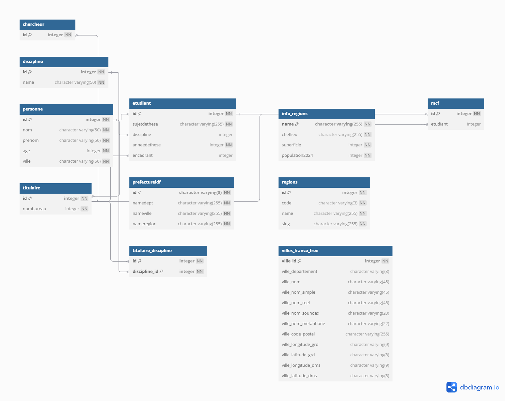

# Projet : Système de gestion multifonctionnel

## Description
Ce projet simule un système de gestion intégrant :
- Chargement dynamique des régions et villes depuis une base de données PostgreSQL.
- Gestion de rôles multiples (étudiants, chercheurs, etc.).
- Résolution du problème du voyageur de commerce (TSP) à l'aide d'un algorithme génétique.

## Prérequis
- **Java** : JDK 8 ou version ultérieure, avec la variable d’environnement `JAVA_HOME` configurée.
- **PostgreSQL** : Service configuré et opérationnel.
- **Dépendances** : Téléchargez le fichier JDBC PostgreSQL (ex. `postgresql-42.7.4.jar`).

## Instructions d’installation

### 1. Cloner le projet
```bash
git clone https://github.com/username/Projet_TSP_Java.git
cd Projet_TSP_Java


### 2. Initialiser la base de données
- Créer une base de données PostgreSQL nommée `projetSQL` :
```sql
CREATE DATABASE projetSQL;
```
- Importer le fichier SQL fourni :
```bash
psql -U postgres -d projetSQL -f projet_java/Projet_TSP_JAVA.sql
```

### 3. Configurer les paramètres de connexion
- Modifier les informations de connexion dans `BDConnect.java` :
```java
private static final String DB_URL = "jdbc:postgresql://localhost:5432/projetSQL";
private static final String USER = "votre_utilisateur";
private static final String PASSWORD = "votre_mot_de_passe";
```

### 4. Compiler le projet
- Créer un répertoire pour les fichiers compilés :
```bash
mkdir bin
```
- Compiler avec :
```bash
javac -d bin -cp lib/postgresql-42.7.4.jar src/projet_java/*.java src/projet_java/Algo/*.java src/projet_java/Geographie/*.java src/projet_java/Personne/*.java
```

### 5. Exécuter le projet
- Lancer le programme principal :
```bash
java -cp "bin;lib/postgresql-42.7.4.jar" projet_java.Main
```

## Fonctionnalités principales
- Chargement et affichage des régions et villes depuis la base de données.
- Gestion de données utilisateur (ex. étudiants et chercheurs).
- Résolution optimisée de TSP avec algorithme génétique.

## Structure du projet
- **src/** : Code source du projet.
- **lib/** : Bibliothèques tierces, comme le driver PostgreSQL.
- **projet_java/Projet_TSP_JAVA.sql** : 

## Contributions
1. Forker le projet.
2. Effectuer vos modifications sur une branche distincte.
3. Soumettre une Pull Request avec des explications claires.

